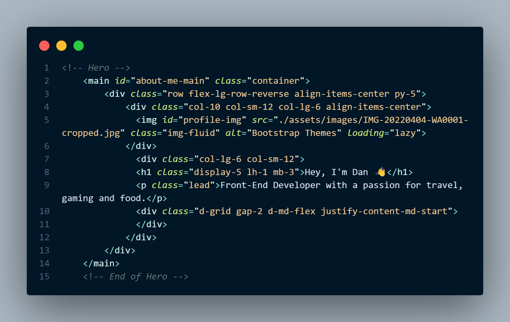
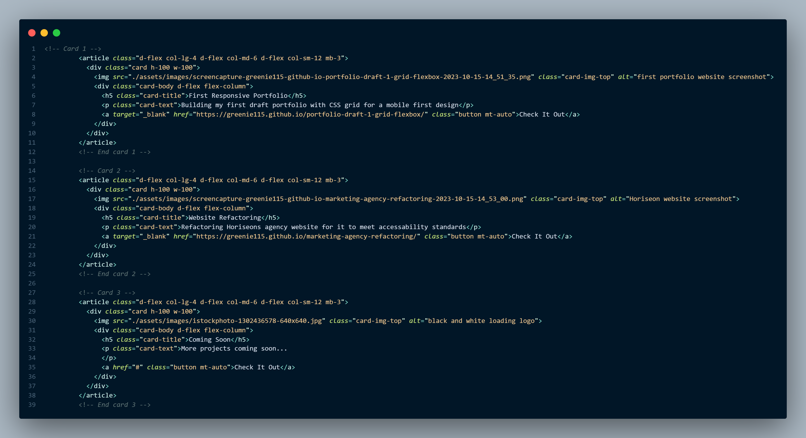
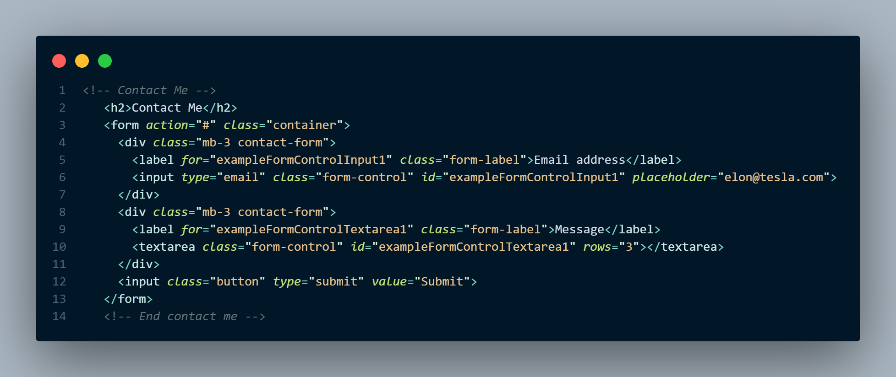

# Bootstrap Portfolio

Live deployed link - https://greenie115.github.io/Bootstrap-portfolio-draft/

This is the second draft of my personal portfolio. This site comprises mostly Bootstrap elements using the pre-build hero, cards, and feature-grid components. 

Hero element

Cards used for projects section

Contact Me submit form 

The aim of this second draft is to showcase the use of responsive mobile-first design. This is shown throughout the page from the navbar to the centered skills section. 

## Installation
N/A 
## Usage

Feel free to resize the web app to see the responsive elements in effect like so

Responsive Cards Section

Responsive Skills section

## Contributing

Pull requests are welcome. For major changes, please open an issue first
to discuss what you would like to change.

Please make sure to update tests as appropriate.

## License

[MIT](https://choosealicense.com/licenses/mit/)